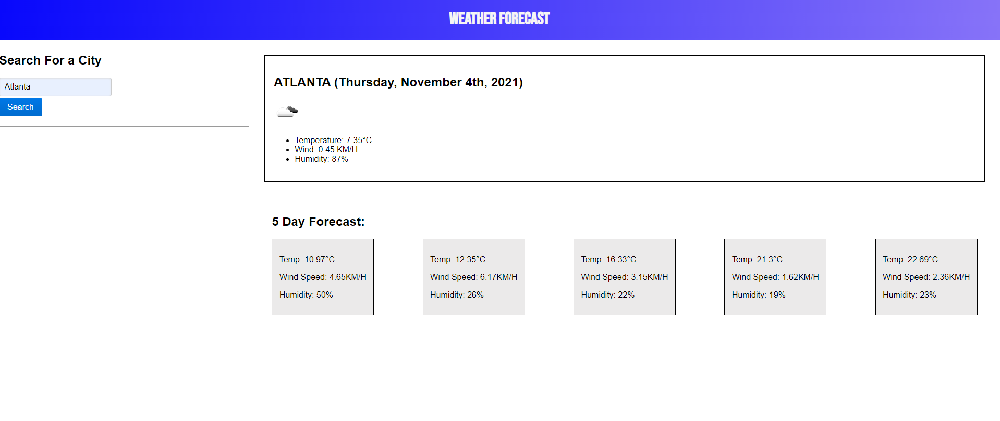

## <Weather Dasboard>

## Table of Contents

  - [Description](#description)
  - [Installation](#installation)
  - [Usage](#usage)
  - [GitHub](#github)
  

## Description

This is an application run from the browser that allows the user to search for the current and 5-day forecast of the weather in a specific City.
Weather can affect our choices regarding activites, mode of transportation, schedules and clothes that we wear. For this reason, it is important to have some idea of the expected kind of weather for the coming days. This application helps the user make more informed decisions that are affected by weather conditions by allowing him/her/they to access the current weather and the 5-day forecast.
  
## License

MIT License

Copyright (c) [2021] [Andres Pena]

Permission is hereby granted, free of charge, to any person obtaining a copy
of this software and associated documentation files (the "Software"), to deal
in the Software without restriction, including without limitation the rights
to use, copy, modify, merge, publish, distribute, sublicense, and/or sell
copies of the Software, and to permit persons to whom the Software is
furnished to do so, subject to the following conditions:

The above copyright notice and this permission notice shall be included in all
copies or substantial portions of the Software.

THE SOFTWARE IS PROVIDED "AS IS", WITHOUT WARRANTY OF ANY KIND, EXPRESS OR
IMPLIED, INCLUDING BUT NOT LIMITED TO THE WARRANTIES OF MERCHANTABILITY,
FITNESS FOR A PARTICULAR PURPOSE AND NONINFRINGEMENT. IN NO EVENT SHALL THE
AUTHORS OR COPYRIGHT HOLDERS BE LIABLE FOR ANY CLAIM, DAMAGES OR OTHER
LIABILITY, WHETHER IN AN ACTION OF CONTRACT, TORT OR OTHERWISE, ARISING FROM,
OUT OF OR IN CONNECTION WITH THE SOFTWARE OR THE USE OR OTHER DEALINGS IN THE
SOFTWARE.

## Installation

No installation is needed. This application is run from the browser.

## Usage

To use this application, go to the gitHub repo, for the repository and run it from your preferred browser.

Once in the landing page, type a city and click on the search button. Information on the current weather and the forecast for the next 5 days will appear to the right in the corresponding sections.

## Credits

Third-party assets:
- [Pure CSS](https://purecss.io/)
- [JQuery](https://jquery.com/)
- [Open Weather API](https://openweathermap.org/)
- [MomentJs](https://momentjs.com/docs/#/use-it/)

Reference material:
- [w3schools](https://www.w3schools.com/)
- [StackOverflow](https://stackoverflow.com/)
- [Mozilla Developer Network](https://developer.mozilla.org/en-US/)
- [CSS-TRICKS guide to flexbox](https://css-tricks.com/snippets/css/a-guide-to-flexbox/)

## GitHub

If you want to know more details, feel free to [visit the repo]()

